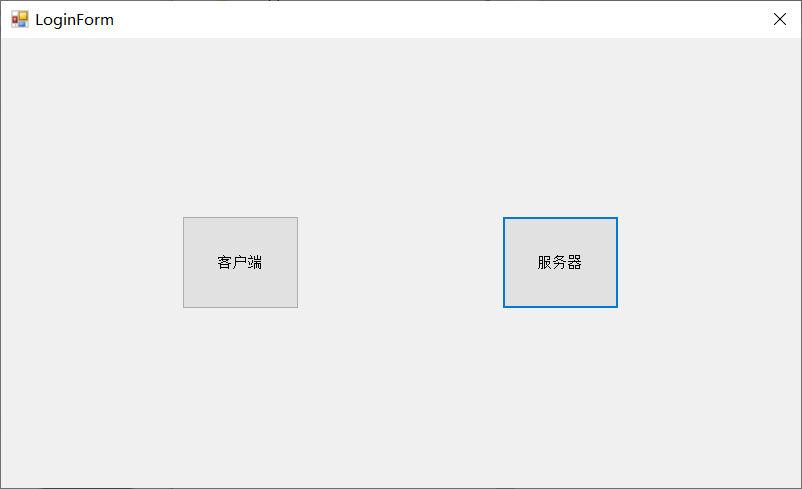
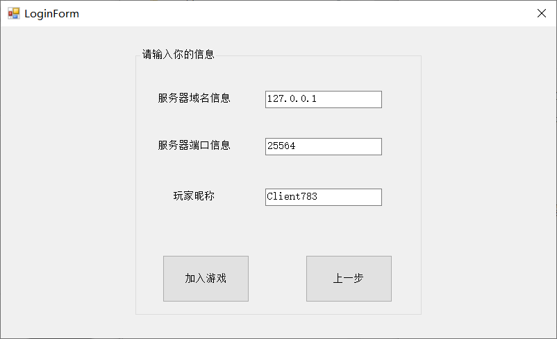
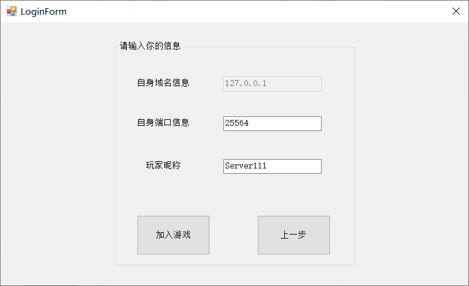
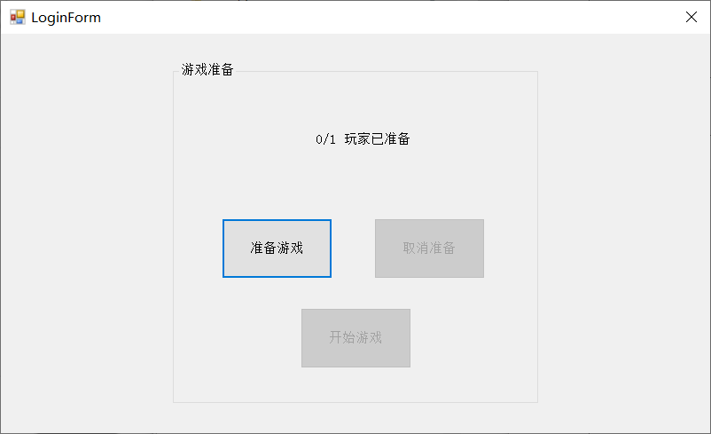
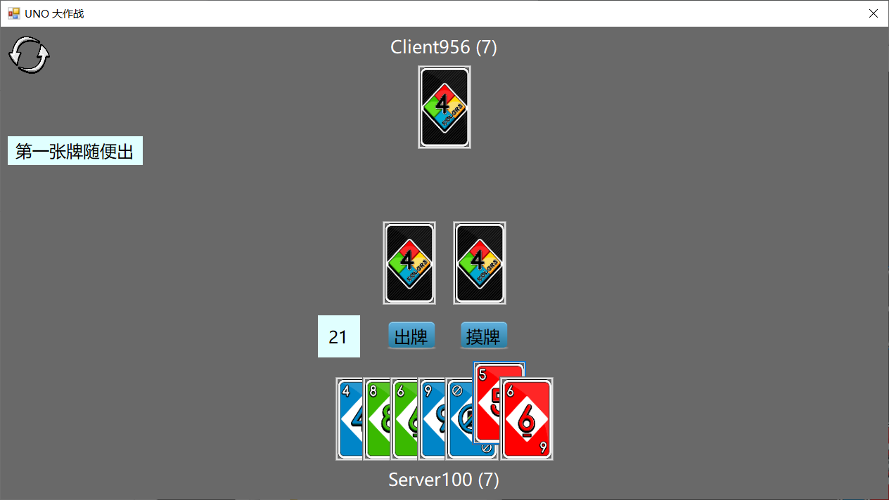
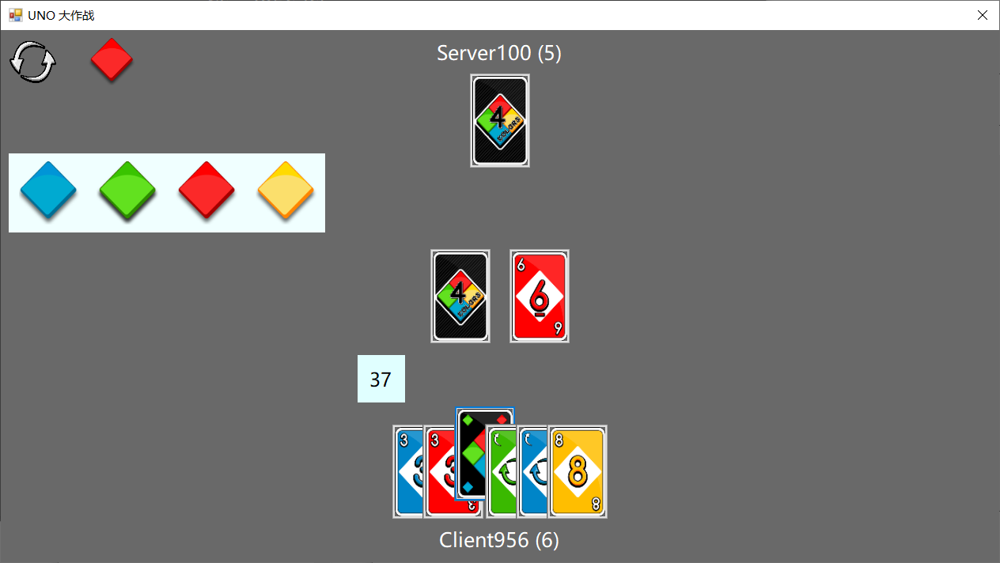
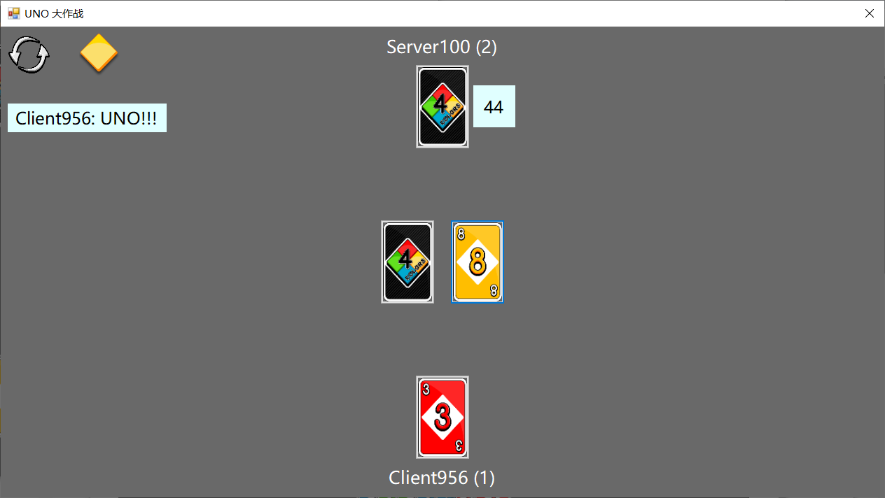
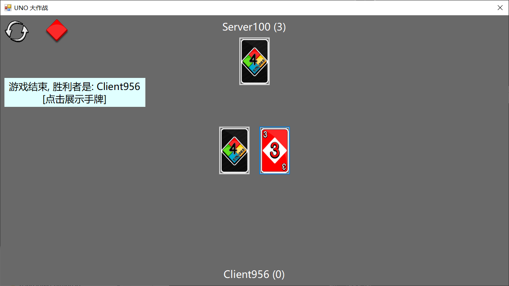
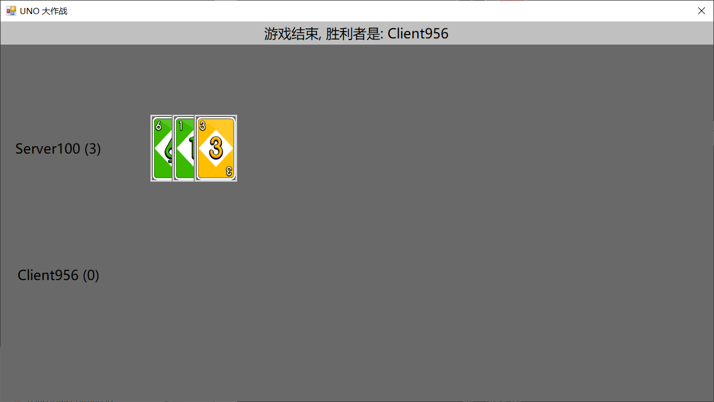
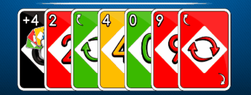

# Multiplayer Uno

一个支持多人联机的Uno.

[SpiritedAwayCN](https://github.com/SpiritedAwayCN),  [banbao990](https://github.com/banbao990)

[TOC]

## 后端

核心技术：Socket通信+多线程+BlockingCollection同步

### 程序架构


Room - 处理游戏过程的类
Player - 玩家类，对于游戏本身只需考虑玩家，实际上派生了LocalPlayer（  本地开服玩家）与RemotePlayer（远程连接玩家）两个子类，不同的玩家类别底层具有不同的消息发送机制

Room实例中会维护游戏处理线程（下称为游戏处理线程），使用BlockingCollection `InfoQueue`实现同步，线程将不断尝试从`InfoQueue`中获取信息，并进行**事件驱动**式的处理。

每个RemotePlayer有两个线程，一个用于接收客户端玩家信息，另一个将信息发送给客户端。它们都有各自的BlockingCollection，以实现游戏处理线程与自己的通信。

PlayerAdapter为前端与后端交互的接口，本地开服使用`LocalPlayerAdapter`，远程连接使用`RemotePlayerAdapter`，它们都继承自`PlayerAdapter`，提供`SendMsg`方法与阻塞队列`RecvQueue`，前端可以使用它们收发信息。

### 游戏运作

本质上，UNO游戏是一个有穷状态自动机，如下：


游戏束流线程本质上也是在执行上述流程，详见`Room`类中的代码注释。

### 前后端通信协议

使用Json通信，此处严格定义了交互的json格式，保证客户端发送的消息足够服务器得知玩家实际的操作内容，而服务器发送至客户端的消息可以使客户端还原出真正的游戏状态，且某些不同的玩家会有不同的信息（如每个玩家在游戏中不能指定别人的手牌）。

具体的Json格式定义，请参阅文件：

* `Client Instruction.xlsx`
* `UNO对照表.xlsx`

### 超时实现与AI

为避免玩家挂机，以及一些其他原因导致游戏进程卡死，此处引入了超时机制，如果玩家在一定时间内不操作，服务器将自动为玩家做出行动。

超时主要使用了`System.Threading.Timer`，通过指定在到达时间后，服务器直接向`InfoQueue`插入玩家行动信息的方式实现服务器代替玩家行动。默认行动，都为无脑取消。

另一方面，玩家可能掉线，玩家掉线后AI将接管，AI也采用向`InfoQueue`插入的方式实现服务器代替玩家做出行动，而AI采用“能出就出”策略。

上述部分均在`Backend/RoomProcess.cs`中有所实现。

### 牌与牌堆

`Utils/Card.cs` - 一张牌，编号0~107，与卡牌对应见`UNO对照表.xlsx`

`Utils/GameCardPile.cs` - 牌堆，包含牌堆与弃牌堆，洗牌算法在其中实现。

### 更多细节

后端还有很多实现细节，此处仅罗列了大的后端设计思想，具体细节可参阅`Backend/`与`Utils/`相关代码中的注释，此处不在赘述。

## 前端UI

### 准备与登录

+ 登陆界面



+ 客户端界面



+ 服务端界面



+ 准备游戏




### 游戏界面

+ 初始出牌界面



+ **万能牌/+4** 选择颜色



+ 只剩一张牌的时候，玩家声称 **UNO**



+ 游戏结束



+ 游戏结束展示手牌




### 主要类

+  `MultiplayerUNO.UI.BUtils.MsgAgency`
    + 静态类，全局变量，用于前后端通信
+  `MultiplayerUNO.UI.BUtils.GameControl`
    + 静态类，全局变量，用于保存控制一局游戏的必要信息
+  `CardButton`
    +  一张卡牌是一个实例

+  `LoginForm`
    +  登录窗口类

+  `MainForm`
    +  游戏窗口类

+  `Animation`、`AnimationSeq`、`AnimationHighlight`
    +  两个动画类


### 机制设计

#### (1) 响应后端指令

+ 根据状态机的设置，不同的状态前端做出不同的响应
    + 这些控制由 `MultiplayerUNO.UI.BUtils.MsgAgency` 静态类控制

```c#
switch (state) {
    case 1: // 某人打出了某张牌
        SomeBodyShowCard(turnInfo);
        break;
    case 2: // 某人摸了一张牌(可能还可以出这张牌)
        GetACard(turnInfo);
        break;
    case 3: // +2 累加, 需要有出牌动画
        ResponedToPlus2(turnInfo);
        break;
    case 4: // 某人摸了若干张牌(摸牌之后结束了)
        SomebodyGetSomeCards(turnInfo);
        break;
    case 5: // 回应 +4
        ResponedToPlus4(turnInfo);
        break;
    case 7: // 游戏结束, 展示所有人手牌
        GameOver(turnInfo);
        break;
    default: break;
}
```

+ 主要响应如下

| state |                  前端响应                  |
| :---: | :----------------------------------------: |
|   1   |    出牌动画、如果是自己出牌显示出牌按钮    |
|   2   | 摸牌动画、如果是自己摸牌显示出摸到的牌按钮 |
|   3   |   出牌动画、如果是自己出牌显示出+2牌按钮   |
|   4   |            摸牌动画（+2 结算）             |
|  35   |    出牌动画、如果是自己出牌显示质疑按钮    |
|   7   |         出牌动画、显示展示手牌按钮         |


#### (2) 出牌设计

+ 所有的状态都运行在后端，因此前端的任何操作都需要得到后端确认之后再执行
+ 例如打牌操作，前端发出打牌指令，只有在收到后端的**某个人打出某张牌**的消息之后才算是真正打出

### UI 设计

#### (1) 图片素材

+ UI 中的图片素材来自于网络
    + [游戏链接](http://web.4399.com/h5/stat/xyx.php?target=uno)

#### (2) 动态定位

+ 根据整个屏幕的大小，动态的调整按钮的位置，因此不会出现错位的问题
+ 根据 panel 的绝对位置以及内部 label 的相对位置定位按钮的位置
    + 因为 C# 中 panel 设置为透明实际上是把 panel 的背景色设置为父控件的背景色，而不是真正的透明，最终把 panel 去掉了

### 动画设计

#### (1) Animation

+ 现在的动画设计比较简单，每一个动画都是一个线程，使用 `Task.Run()` 来实现
    + 这样的实现也会导致线程过多有些卡顿的现象
+ 每个动画可以包含多个控件
    + 例如在最后展示手牌的时候，每个人的第 `i` 张牌属于第 `i` 个线程
+ 现在只支持**平移**和**翻转**两种动画，动画的时间平移的距离控制（**所有平移动画的速度相同**）

#### (2) AnimationSeq

+ 由一组动画（Animation）组成
+ 可以同时触发这些动画、也可以实现动画序列的有序性

#### (3) AnimationHighlight

+ 突出动画，可以控制时间（这一步的设计和上面动画不同，所以单独做出来了）
+ 用于显示出反转牌的时候的突出方向被改变

### 收获与改进

#### 收获

+ 控件的 Tag 设计挺好的，可以用户保存一些用户信息
    + 有一个用于短时显示提示信息的 label，在 Tag 上面记录了显示剩余时间
    + 显示方向的 label，利用 Tag 记录了顺时针和逆时针两张 Bitmap
+ 对应 C# 的基本知识有了更深的理解
+ 学到了 `await/async` 的使用，异步编程变得更加简单
    + 注意死锁问题
+ winform 的控件的真的丑

#### 改进

+ 动画的设计
    + 如何使用一个线程实现？这样效率更高
        + 同步问题的解决
    + 如何设计一个很好的抽象基类 Animation
    + 重新洗牌的动画，现在是一张牌一个线程，可以修改为 3 个线程
        + 上下位置归位、右边向左移、移动到正确的位置
        + 参考如下



+ 整体的代码结构稍显混乱，尤其是很多全局变量用于控制状态
    + 游戏设计的两种方式：状态机、条件变量
        + 显然状态机的设置是更棒的！
+ UI 如何调的更好看，这个受限于 WinForm
