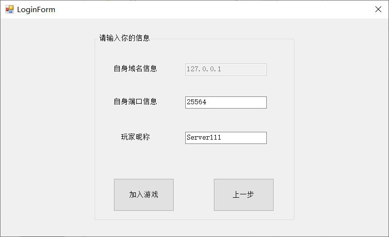
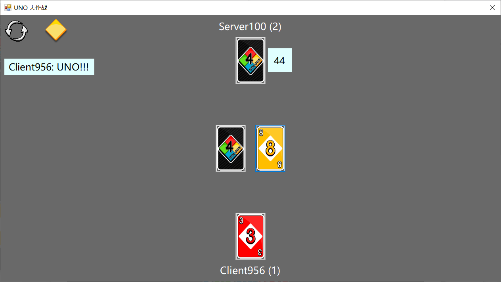

# UI

> [banbao990](https://github.com/banbao990)

[TOC]

## 0. 说明

+ 这里是 UI 设计部分的报告
+ 报告主要分为如下几个部分
    + UI 概览
    + 一些机制的设计
    + UI 设计
    + 动画设计
    + 改进
    + 参考资料

## 1. 概览

### (1) 准备与登录

+ 登陆界面

+ 客户端界面

+ 服务端界面

+ 准备游戏

### (2) 游戏界面

+ 初始出牌界面

+ **万能牌/+4** 选择颜色

+ 只剩一张牌的时候，玩家声称 **UNO**

+ 游戏结束

+ 游戏结束展示手牌

## 2. 类设计

+  `MultiplayerUNO.UI.BUtils.MsgAgency`
    + 静态类，全局变量，用于前后端通信
+ `MultiplayerUNO.UI.BUtils.GameControl`
    + 静态类，全局变量，用于保存控制一局游戏的必要信息

## 3. 机制设计

### (1) 响应后端指令

+ 所有的状态都运行在后端，因此前端的任何操作都需要得到后端确认之后再执行
    + 例如打牌操作，前端发出打牌指令，只有在收到后端的**某个人打出某张牌**的消息之后才算是真正打出
+ 根据状态机的设置，不同的状态前端做出不同的响应
    + 这些控制由 `MultiplayerUNO.UI.BUtils.MsgAgency` 静态类控制

| state | 前端响应 |
| :---: | :------: |
|       |          |
|       |          |
|       |          |
|       |          |
|       |          |
|       |          |
|       |          |
|       |          |
|       |          |

