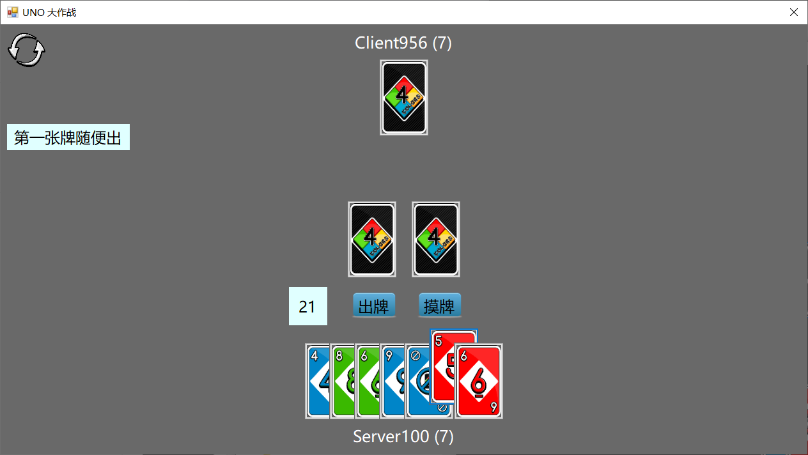
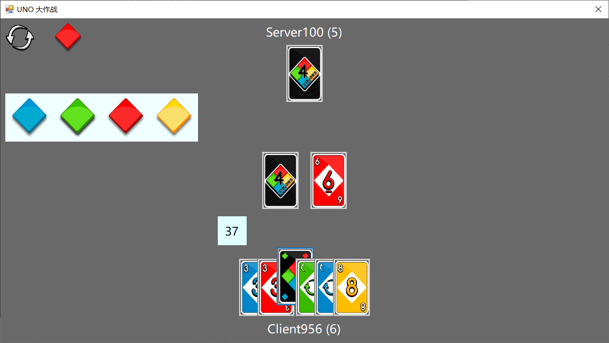
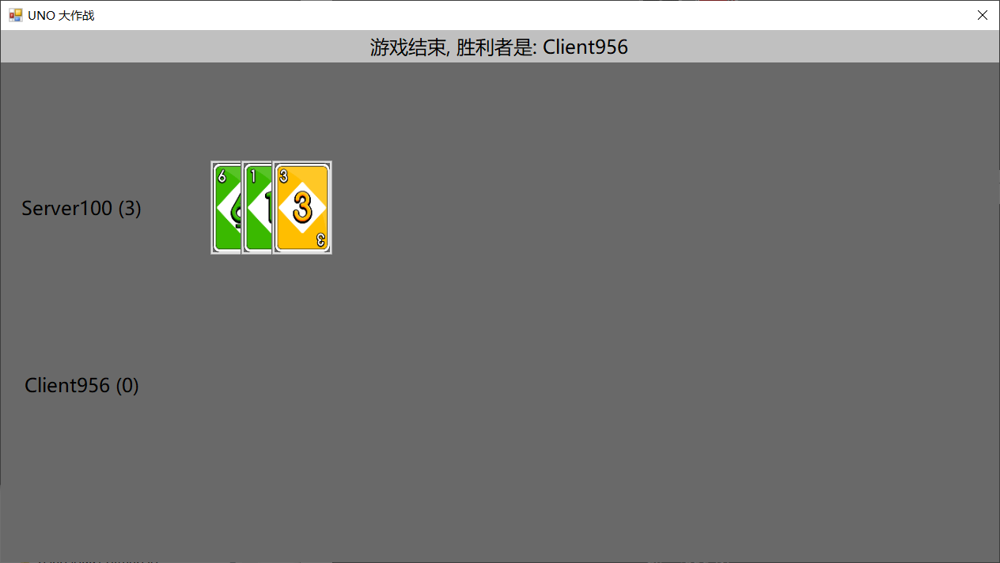
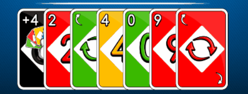

# UI

> [banbao990](https://github.com/banbao990)


[TOC]


## 0. 说明

+ 这里是 UI 设计部分的报告
+ 报告主要分为如下几个部分
    + UI 概览
    + 机制设计
    + UI 设计
    + 动画设计
    + 收获与改进


## 1. 概览

### (1) 准备与登录

+ 登陆界面


+ 客户端界面


+ 服务端界面


+ 准备游戏


### (2) 游戏界面

+ 初始出牌界面



+ **万能牌/+4** 选择颜色



+ 只剩一张牌的时候，玩家声称 **UNO**


+ 游戏结束


+ 游戏结束展示手牌




## 2. 主要类

+  `MultiplayerUNO.UI.BUtils.MsgAgency`
    + 静态类，全局变量，用于前后端通信
+  `MultiplayerUNO.UI.BUtils.GameControl`
    + 静态类，全局变量，用于保存控制一局游戏的必要信息
+  `CardButton`
    +  一张卡牌是一个实例

+  `LoginForm`
    +  登录窗口类

+  `MainForm`
    +  游戏窗口类

+  `Animation`、`AnimationSeq`、`AnimationHighlight`
    +  两个动画类


## 3. 机制设计

### (1) 响应后端指令

+ 根据状态机的设置，不同的状态前端做出不同的响应
    + 这些控制由 `MultiplayerUNO.UI.BUtils.MsgAgency` 静态类控制

```c#
switch (state) {
    case 1: // 某人打出了某张牌
        SomeBodyShowCard(turnInfo);
        break;
    case 2: // 某人摸了一张牌(可能还可以出这张牌)
        GetACard(turnInfo);
        break;
    case 3: // +2 累加, 需要有出牌动画
        ResponedToPlus2(turnInfo);
        break;
    case 4: // 某人摸了若干张牌(摸牌之后结束了)
        SomebodyGetSomeCards(turnInfo);
        break;
    case 5: // 回应 +4
        ResponedToPlus4(turnInfo);
        break;
    case 7: // 游戏结束, 展示所有人手牌
        GameOver(turnInfo);
        break;
    default: break;
}
```

+ 主要响应如下

| state |                  前端响应                  |
| :---: | :----------------------------------------: |
|   1   |    出牌动画、如果是自己出牌显示出牌按钮    |
|   2   | 摸牌动画、如果是自己摸牌显示出摸到的牌按钮 |
|   3   |   出牌动画、如果是自己出牌显示出+2牌按钮   |
|   4   |            摸牌动画（+2 结算）             |
|  35   |    出牌动画、如果是自己出牌显示质疑按钮    |
|   7   |         出牌动画、显示展示手牌按钮         |


### (2) 出牌设计

+ 所有的状态都运行在后端，因此前端的任何操作都需要得到后端确认之后再执行
+ 例如打牌操作，前端发出打牌指令，只有在收到后端的**某个人打出某张牌**的消息之后才算是真正打出


## 4. UI 设计

### (1) 图片素材

+ UI 中的图片素材来自于网络
    + [游戏链接](http://web.4399.com/h5/stat/xyx.php?target=uno)


### (2) 动态定位

+ 根据整个屏幕的大小，动态的调整按钮的位置，因此不会出现错位的问题
+ 根据 panel 的绝对位置以及内部 label 的相对位置定位按钮的位置
    + 因为 C# 中 panel 设置为透明实际上是把 panel 的背景色设置为父控件的背景色，而不是真正的透明，最终把 panel 去掉了


## 5. 动画设计

### (1) Animation

+ 现在的动画设计比较简单，每一个动画都是一个线程，使用 `Task.Run()` 来实现
    + 这样的实现也会导致线程过多有些卡顿的现象
+ 每个动画可以包含多个控件
    + 例如在最后展示手牌的时候，每个人的第 `i` 张牌属于第 `i` 个线程
+ 现在只支持**平移**和**翻转**两种动画，动画的时间平移的距离控制（**所有平移动画的速度相同**）


### (2) AnimationSeq

+ 由一组动画（Animation）组成
+ 可以同时触发这些动画、也可以实现动画序列的有序性


### (3) AnimationHighlight

+ 突出动画，可以控制时间（这一步的设计和上面动画不同，所以单独做出来了）
+ 用于显示出反转牌的时候的突出方向被改变


## 6. 收获与改进

### (1) 收获

+ 控件的 Tag 设计挺好的，可以用户保存一些用户信息
    + 有一个用于短时显示提示信息的 label，在 Tag 上面记录了显示剩余时间
    + 显示方向的 label，利用 Tag 记录了顺时针和逆时针两张 Bitmap
+ 对应 C# 的基本知识有了更深的理解
+ 学到了 `await/async` 的使用，异步编程变得更加简单
    + 注意死锁问题
+ winform 的控件的真的丑


### (2) 改进

+ 动画的设计
    + 如何使用一个线程实现？这样效率更高
        + 同步问题的解决
    + 如何设计一个很好的抽象基类 Animation
    + 重新洗牌的动画，现在是一张牌一个线程，可以修改为 3 个线程
        + 上下位置归位、右边向左移、移动到正确的位置
        + 参考如下



+ 整体的代码结构稍显混乱，尤其是很多全局变量用于控制状态
    + 游戏设计的两种方式：状态机、条件变量
        + 显然状态机的设置是更棒的！
+ UI 如何调的更好看，这个受限于 WinForm
