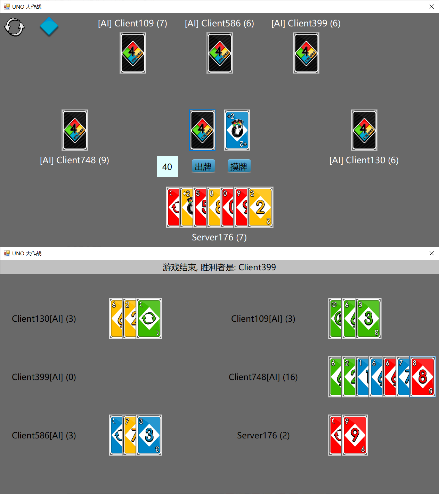

# UNO

+ 这是个在线的 UNO 小游戏，支持 2-6 人联机进行游戏

## 1. 游戏规则

+ 和我们平时玩的 UNO 游戏基本相同，但是考虑到实现难度以及游戏本身的合理性，我们做了一些简单的修改
+ 简单来说
    + 最后一张牌不能出**+4牌**
    + **+4牌**不能叠加，**+4牌**也不能叠在**+2牌**上
    + **+2牌**可以叠加

### (1) 一般规则

+ 玩家们围成一圈，按照指定顺序出牌（初始方向为逆时针，初始玩家随机指定）

#### 一般出牌规则

+ 第一个出牌的人可以出**任意牌**，当然也可以不出牌（摸牌）
    + 如果第一个玩家没有出牌，此时下一个玩家可以出任意牌，以此类推
+ 如果已经有人出过牌了，则轮到出牌的玩家只能出和**参考牌**（上一张出的牌）**牌型**或者**颜色**一致的牌，如果无牌可出则摸一张牌
    + 牌型一致
        + 如果是**数字牌**，数字一致才一致
        + 如果是**功能牌**，类型一致就一致
    + 如果摸上来的牌满足上述出牌条件，则也可以将这张牌打出（只能够打这张牌）

#### 功能区出牌规则

+ 功能区出牌规则按照不同功能区的规定即可（**优先级高于一般出牌规则**）

#### 功能牌

+ **+2牌**

    + 某个玩家打出**+2牌**之后，进入**+2牌**的功能区，初始累计牌为**2**
        + 在**+2牌**的功能区中，轮到出牌的玩家只能出**+2牌**

    + 如果轮到出牌的玩家出了**+2牌**，此时**+2牌**的功能区继续保持，**累计牌+2**

    + 如果轮到出牌的玩家没有出牌，此时当前玩家摸 N 张牌（N为当前**+2牌**功能区的累计牌数），**+2牌**的功能区结束

+ **禁止牌**
    + 此时跳过下一个玩家的出牌阶段
+ **反转牌**
    + 此时出牌方向逆转（逆时针 `->` 顺时针，顺时针 `->` 逆时针）
+ **万能牌**
    + 万能牌能够响应任何**参考牌**（上一张出的牌）
    + 打出**万能牌**的玩家选择一种颜色，作为参考牌的颜色
+ **+4牌**
    + 万能牌能够响应任何**参考牌**（上一张出的牌）
    + 打出**+4牌**的玩家选择一种颜色，作为参考牌的颜色
    + 当参考牌（上一张出的牌）是**+4牌**时，此时轮到出牌的玩家可以选择**质疑**或者**不质疑**
        + 如果**不质疑**，则直接摸**4**张牌，跳过出牌阶段
        + 如果**质疑**
            + 质疑成功则出**+4牌**的玩家摸**4**张牌，当前玩家继续出牌
            + 之以失败，则当前玩家摸**6**张牌，跳过出牌阶段
        + **质疑成功**：出**+4牌**的玩家还有其他非**+4牌**满足出牌条件

### (2) 特判

+ 平局：当牌堆（把弃牌都加进去之后）里没有牌了，此时视为平局
+ 最后一张牌不能出**+4牌**

## 2. 使用说明

+ 首先需要有某个玩家选择**服务端**打开，剩下的玩家选择**客户端**接入
+ 之后**准备游戏**即可，当所有人都准备好的时候，人以玩家可以选择**开始游戏**
+ 当某个客户端玩家掉线之后，会被 **AI 永远接管**（策略是随机出满足出牌条件的牌）
    + 如果在出牌阶段掉线，则 AI 会在他**下一轮**出牌的时候接管
    + 因此可以在进入房间之后马上断开非出牌的客户端，此时他们都会被 AI 接管，实现人机对局
+ 几个示例视频
    + TODO
